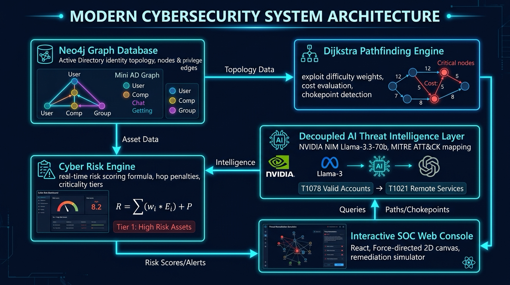
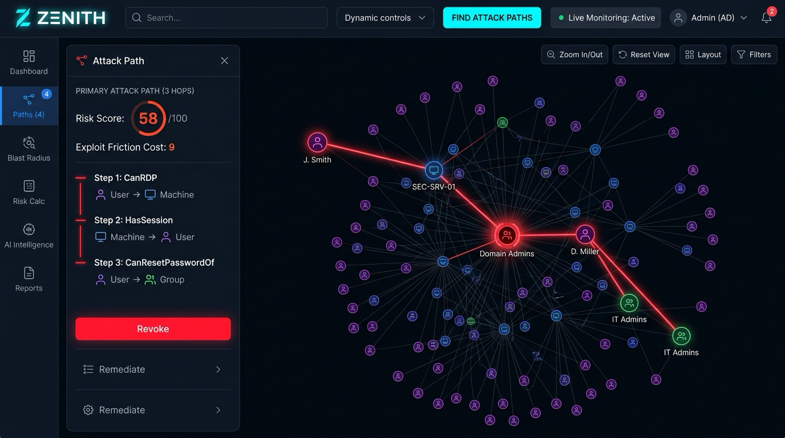
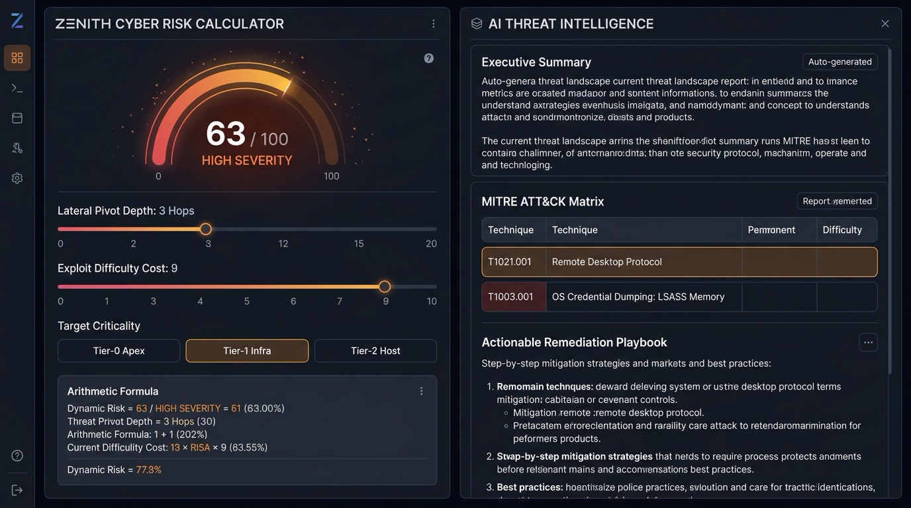

# ZENITH — Attack Path & Identity Privilege Graph Analyzer

> **Kurukshetra 2.0 Hackathon | Domain 2: Cybersecurity & Blockchain (Expert Tier)**  
> *Deterministic Graph Intelligence for Multi-Hop Active Directory & Cloud IAM Attack Paths*

---

## Executive Summary

**ZENITH** is an enterprise-grade identity privilege graph and attack path analyzer inspired by SpecterOps BloodHound. It models organizational identities (users, groups, service accounts, machines) as a directed property graph in **Neo4j** and uses real **Cypher graph algorithms** to mathematically discover, cost-weight, and remediate dangerous multi-hop privilege escalation routes.

ZENITH strictly adheres to the principle of **deterministic mathematical path calculation**—reserving AI/LLM capabilities exclusively for post-calculation threat narration, MITRE ATT&CK alignment, and executive security briefings *after* paths have been proven mathematically.

---

## System Architecture



```
[ Active Directory / Cloud IAM Identities ]
                    │
                    ▼
       ┌────────────────────────┐
       │   Neo4j Graph Store    │ ◄── 127 Nodes, 300+ Edges
       └───────────┬────────────┘
                   │ Cypher Traversal
                   ▼
       ┌────────────────────────┐
       │ Dijkstra Engine (Math) │ ◄── Exploit Friction Weights (1-10)
       └───────────┬────────────┘
                   │
         ┌─────────┴─────────┐
         ▼                   ▼
┌──────────────────┐ ┌──────────────────────┐
│  Risk Calculator │ │ Decoupled AI Threat  │ ◄── NVIDIA NIM Llama-3.3-70b
│  Dynamic Engine  │ │ Intelligence Engine  │     (MITRE ATT&CK Playbook)
└────────┬─────────┘ └──────────┬───────────┘
         │                      │
         └─────────┬────────────┘
                   ▼
       ┌────────────────────────┐
       │ SOC Interactive UI     │ ◄── React 18, 2D Force Graph,
       │ (Dark Console)         │     Live Remediation Simulation
       └────────────────────────┘
```

---

## Repository Layout

This repository conforms strictly to the official Hackathon submission structure:

```
KH001-TeamName/
│
├── README.md                           # Master project documentation
├── LICENSE                             # MIT Open Source License
│
├── src/                                # Project Source Code
│   ├── backend/                        # Node.js + Express + Neo4j Bolt API
│   │   ├── config/                     # Database connection & taxonomy definitions
│   │   ├── routes/                     # /graph, /paths, /blast-radius, /simulate-remediation, /inject
│   │   ├── services/                   # GraphService (Cypher) & LLMService (NIM)
│   │   ├── scripts/                    # Diagnostics test suite & seed generator
│   │   └── server.js                   # Backend entrypoint (Port 4000)
│   ├── frontend/                       # React 18 + Vite interactive graph console
│   │   ├── src/components/GraphView.jsx# Force-directed canvas, Risk Calc, Blast, AI panels
│   │   └── src/api.js                  # Axios client for backend services
│   └── landing-page/                   # Cinematic product gateway
│       ├── index.html                  # Landing page structure
│       ├── styles.css                  # Custom styling & glassmorphism
│       └── main.js                     # Interactive animations & telemetry
│
├── docs/                               # Comprehensive Documentation
│   ├── project-documentation.pdf       # Official 2-page system whitepaper (PDF)
│   ├── project-documentation.md        # Technical architecture & mathematical proof
│   ├── architecture.png                # High-resolution system architecture diagram
│   └── other-diagrams/                 # Supporting diagrams
│       └── attack-graph.png            # Multi-hop attack path visualization diagram
│
├── screenshots/                        # Application UI Screenshots
│   ├── screenshot-1.png                # Primary Attack Path & Force Graph Console
│   └── screenshot-2.png                # Interactive Cyber Risk Calculator & AI Threat Panel
│
├── data/                               # Dataset & Seed Definitions
│   ├── README.md                       # Active Directory synthetic graph specification
│   └── taxonomy.json                   # Machine-readable relationship weights & MITRE codes
│
├── package.json                        # Root workspace script orchestrator
└── .gitignore                          # Clean gitignore for dependencies & build artifacts
```

---

## Quick Start (Running Locally)

### 1. Prerequisites
- **Node.js**: `v18+` (Tested on Node `v20` / `v26`)
- **Neo4j Database**: `v5.x` running on `bolt://localhost:7687` (Default: `neo4j` / `password123`)

### 2. Installation
Install dependencies for both backend and frontend:
```bash
# Install backend dependencies
cd src/backend && npm install

# Install frontend dependencies
cd ../frontend && npm install

# Return to root
cd ../..
```

### 3. Seed Database
Seed the synthetic enterprise Active Directory identity graph into Neo4j:
```bash
npm run seed
# or
node src/backend/scripts/seedData.js
```

### 4. Start the Application
You can run services from the root or dedicated folders:

**Option A — Running services concurrently**:
```bash
# Start backend on http://localhost:4000
npm run dev:backend

# In a second terminal, start frontend on http://localhost:5173
npm run dev:frontend
```

**Option B — Direct navigation**:
```bash
# Terminal 1: Backend
cd src/backend
node server.js

# Terminal 2: Frontend
cd src/frontend
npm run dev
```

### 5. Access the Platform
- **Interactive SOC Graph Console**: Open `http://localhost:5173`
- **Product Landing Page**: Open `src/landing-page/index.html` in your browser

---

## Automated Diagnostic Verification

Execute the comprehensive 15-test diagnostic verification suite covering all graph traversal, blast radius calculations, chokepoint severance, and schema validations:

```bash
npm test
# or
node src/backend/scripts/testSuite.js
```

**Test Suite Output**:
```
====================================================
       ZENITH SYSTEM DIAGNOSTIC TEST SUITE          
====================================================

[TEST] GET /api/relationship-types (Taxonomy check)         PASSED (7ms)
[TEST] GET /api/graph (Full topology payload)               PASSED (4ms)
[TEST] GET /api/paths (Planted Path 1: RDP session hijack)  PASSED (6ms)
[TEST] GET /api/paths (Planted Path 2: DCOM host trust)     PASSED (3ms)
[TEST] GET /api/paths (Planted Path 3: GPO ACL abuse)       PASSED (2ms)
[TEST] GET /api/paths (Planted Path 4: Kerberoasting)       PASSED (1ms)
[TEST] GET /api/paths (Non-existent identity boundary check) PASSED (2ms)
[TEST] GET /api/blast-radius/:id (Reachable cascade check)  PASSED (2ms)
[TEST] POST /api/simulate-remediation (Chokepoint elimination) PASSED (6ms)
[TEST] POST /api/simulate-remediation (Alternate route rerouting) PASSED (4ms)
[TEST] POST /api/explain-path (Strict JSON Schema Validation) PASSED (1ms)
[TEST] POST /api/explain-path (Dynamic Path Adaptation)     PASSED (1ms)
[TEST] POST /api/explain-path (Direct Canonical Payload Input) PASSED (1ms)
[TEST] POST /api/explain-path (Resilient Fallback on Unavailable NIM) PASSED (350ms)
[TEST] POST /api/inject (Live relationship insertion into Neo4j) PASSED (16ms)

====================================================
TOTAL: 15 | PASSED: 15 | FAILED: 0
====================================================
```

---

## Screenshots & Showcase

### Primary Attack Path & Force Graph Console


### Dynamic Cyber Risk Calculator & AI Threat Intelligence


---

## Key Innovation Highlights

1. **Deterministic Dijkstra Graph Traversal**: Discovers shortest and cheapest attack paths using exact Cypher variable-length walk queries (`MATCH p = (start)-[*1..6]->(end)`).
2. **Interactive Chokepoint Remediation**: Simulates revoking individual privileges and instantly determines whether attack paths are eliminated or rerouted.
3. **Real-Time Dynamic Risk Engine**:
   $$\text{Score} = \text{clamp}\left(5, 100, \text{Base} - (\text{Cost} \times 3.5) - (\text{Hops} \times 2.5) + \text{SurfaceFactor}\right)$$
4. **Decoupled AI Threat Intelligence**: Powered by NVIDIA NIM (`meta/llama-3.3-70b-instruct`) with zero exposed API keys or user configuration hurdles.
5. **Live Scenario Injection**: Inject new privilege relationships into the running Neo4j database live during presentations to demonstrate real-time graph adaptation.

---

## License
This project is licensed under the MIT License — see the [LICENSE](LICENSE) file for details.
